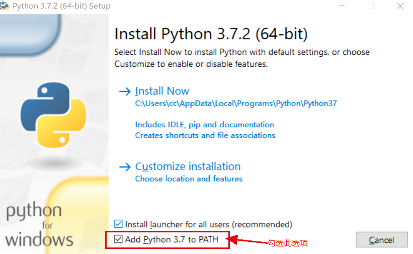
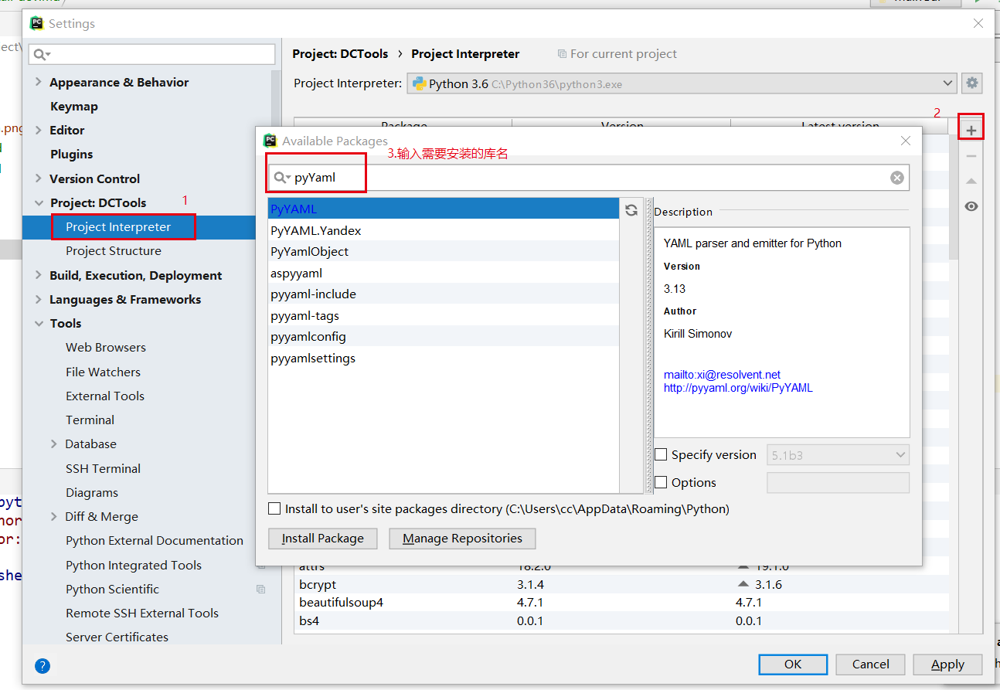
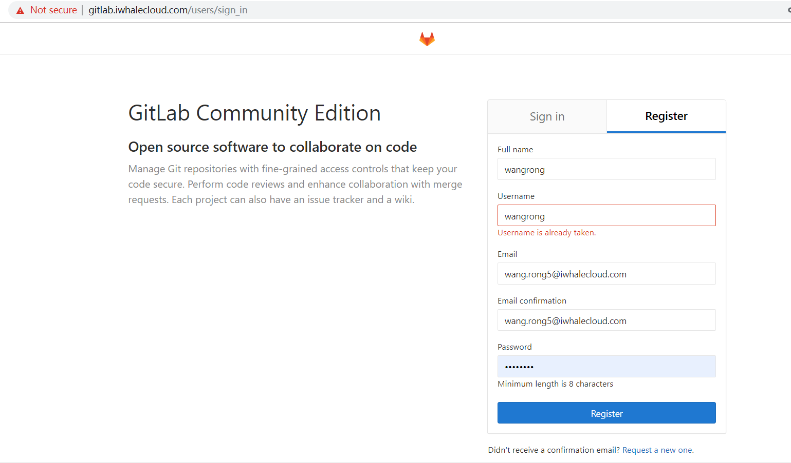
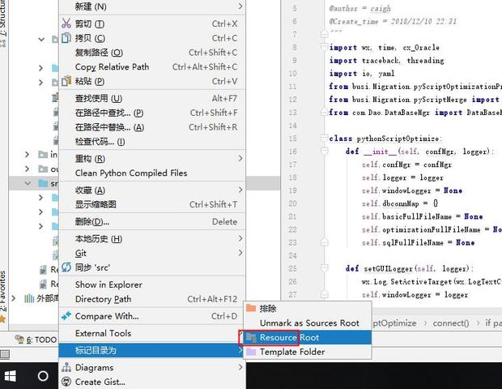
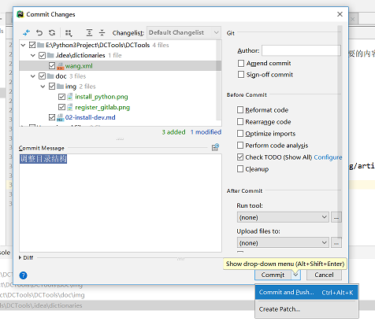

# 开发环境
## 安装Python3+
根据操作系统类型, 下载最新的**Python3+**版本(https://www.python.org/)
强烈推荐3.8 及以上版本（目前不推荐3.10）
Python3+的安装是图形化安装，需要注意如下选项即可，其余均可一路下一步到底

**Add Python to PATH**请一定要勾选，如果未勾选，后期需要自行添加到系统环境变量中

## 安装必须的Python库
+ Python库:
  - cx-Oracle (pip install cx_Oracle)
  - PyYAML (pip install PyYAML)
  - pyQt5 (pip install PyQt5)
  - xlrd
  - openpyxl
  - DBUtils   (要求2.0或者以上的版本)
  - PyMySQL
  - Requests  (贵华增加，用来做记录日志用的)
  - numpy (靖诗增加，目前用途未知)
  - mysql-connector (靖诗增加，mysql的驱动进行更换)
  - pymongo (靖诗增加，MongoDB的驱动)
  - jaydebeapi  (OceanBase驱动的目的)
  
* 在命令窗口安装(推荐)：
**pip install <库名称>** 例如 `pip install cx_Oracle`
如果存在**多个python**版本，可以使用如下命令 `python3 -m pip install cx_Oracle`
* 图形界面安装：
从pycharm IDE开发工具中进行图形化界面安装, 打开`File->Settings`界面, 按下图操作

## 注册gitlab
+ 注册地址： http://gitlab.iwhalecloud.com/users/sign_in, 按要求输入需要的内容即可(**建议使用公司邮箱**)

+ **告知DC管理员**, 增加进入**DCGroup**
  - DC管理员: fang.yueming@iwhalecloud.com

  
## 安装git
百度搜索`git windows` 或`git mac`来获取下载链接
针对mac安装, 可以通过App store中的Xcode安装

## 安装PyCharm
Pycharm下载链接：http://www.jetbrains.com/pycharm/download
建议安装Community的版本。
Pycharm下需要添加External Libraries,可以参考 https://blog.csdn.net/hfutdog/article/details/81711531
### PyCharm下设置代码的根目录
- 代码中的import 不需要带src的目录，例如：from GUI.File.IniTable.IniTable import Ui_IniTable

### Pycharm下提交修改代码
- 在完成对代码修改后, 快捷键`CTRL+K`打开对代码提交对话框

如上图所示：commit是有两种类型的, 可以根据自身需求进行选择
 + commit: 仅仅只是提交，保存在本地
 + commit and push：不仅提交了，还上传到远端的gitlab中

> 说明：
> 如果在打开的对话框中没有你新增的文件，可以手动添加进去，选中需要添加的文件，然后按下快捷键`CTRL+ALT+A`, 再次打开`commit`界面时, 就会出现你刚刚新增的文件了
>

### [Pycharm安装.ignore插件](https://blog.csdn.net/zheng__jun/article/details/79972085)

