# 第一章：写在前面

## 1.1 DCTools

> DCTools是一个进行数据配置的工具，它是一个软件，是我们数据配置团队自己研发维护的工具。

普通的软件，通常是下载一个类似`.exe`格式的安装程序，然后双击它点击下一步之类的进行安装。而DCTools则不同，它是一个免安装的绿色版软件，用户下载`.zip`格式的压缩包以后，解压到本地某个目录下，就安装成功了。使用的时候，只需要双击解压出来的DCTools.exe就可以打开并使用DCTools了。

## 1.2 主要内容

> 本篇文档将详细说明以下两个问题：

1. 如何从公司的Gitlab上获取DCTools的源码；
2. 详细介绍DCTools打包的整个过程；

## 1.3 明确概念

> 什么叫程序打包？

所谓的程序打包，就是使用DCTools的源码，“制作”出一个名为`DCTools.exe`的可执行程序，然后将该可执行程序和一些配置文件进行压缩打包，供其他人来下载解压使用！也就是说，由源码到压缩包的操作过程，我们叫做“程序打包”！


# 第二章：获取源码

## 2.1 准备工作

> DCTools的源码是放在公司的Gitlab上的，想要获取源码需要两个条件：

1. 本机要先安装Git（Git一般还配合TortoiseGit一起使用）；
2. 到Gitlab上获取代码，需要该代码仓库的权限，找负责人申请；

## 2.2 获取代码

1. 使用Git下载代码的具体操作就不废话了，有很多种方式，这里记录一下DCTools的Gitlab地址：

   ```bash
   http://gitlab.iwhalecloud.com/DC/DCTools
   ```

2. 注意点：在下载代码的之前，需要输入访问Gitlab上DCTools所在路径的权限，需要提前申请，如下图所示：
   
   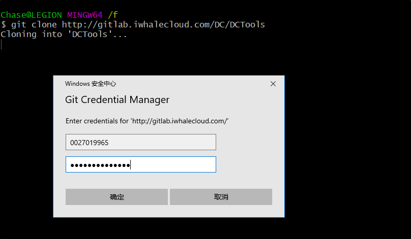

3. 下载下来的完整的DCTools的文件：

   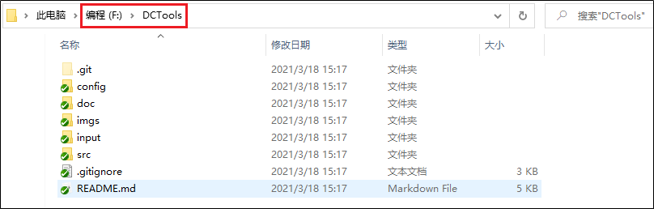


# 第三章：打包步骤

## 3.1 安装Python

> DCTools使用Python编写，所以运行DCTools程序，必须要有Python环境，要求版本必须3.6及以上；

但最好是安装3.8版本，因为当前的DCToolas已经使用了Python3.8中的一些新内容，以后会要求版本至少3.8。

## 3.2 安装PyCharm

> PyCharm是一款优秀的Python编辑器，使用PyCharm给Python项目添加依赖，编辑和运行项目都比较方便。

本文档中安装的PyCharm的版本是2020.3.5。

## 3.4 添加Python依赖

> DCTools的代码运行，不仅要依赖Python环境，还要依赖于一些第三方的Python包，需要手动添加到DCTools工程中。

### 3.4.1 需要哪些依赖

- cx-Oracle
- PyYAML
- pyQt5
- xlrd
- openpyxl
- DBUtils   (要求2.0或者以上的版本)
- PyMySQL
- requests（贵华增加，用来做记录日志用的）
- numpy（靖诗增加，目前用途未知）
- mysql-connector（靖诗增加，mysql的驱动进行更换）
- pymongo（靖诗增加，MongoDB的驱动）
- pywin32-ctypes
- pyinstaller（下面打包时需要它）

### 3.4.2 如何添加依赖

1. 检查PyCharm的Python解释器

   使用PyCharm打开工程，再依次打开File>Settings>Project:DCTools>Python Interpreter：

   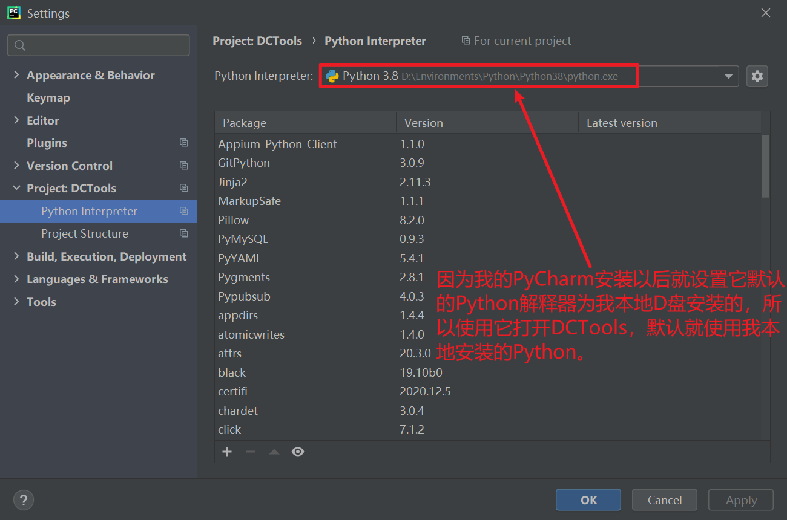

   假如你的Python解释器不是你本地安装的话，那你就要先设置一下！一定要让DCTools使用你本地安装的Python！

2. 点击上图中的小`+`号，在跳出的弹窗上进行如下操作：

   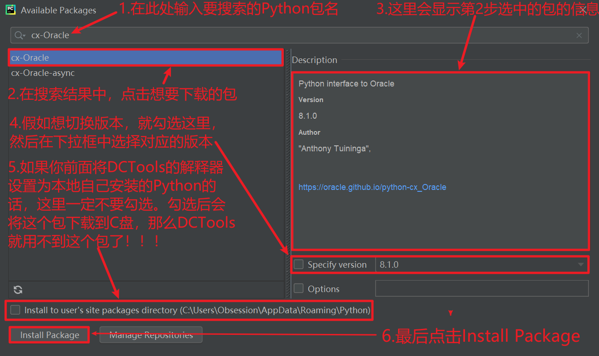

   <font color=red>**这里一定要注意**</font>：因为DCTools是使用我安装在D盘下的Python来解释运行的，所以千万千万不要勾选“Install to user's......”选项！假如勾选了它，就相当于在命令行直接使用“pip”开头的命令来下载Python依赖包，而不勾选的话就相当于在命令行使用“python -m pip”开头的命令来下载Python依赖包，两者的区别就是前者会把包下载到C盘，后者会将包下载到D盘。

   安装完成后，会有这样的提示：

   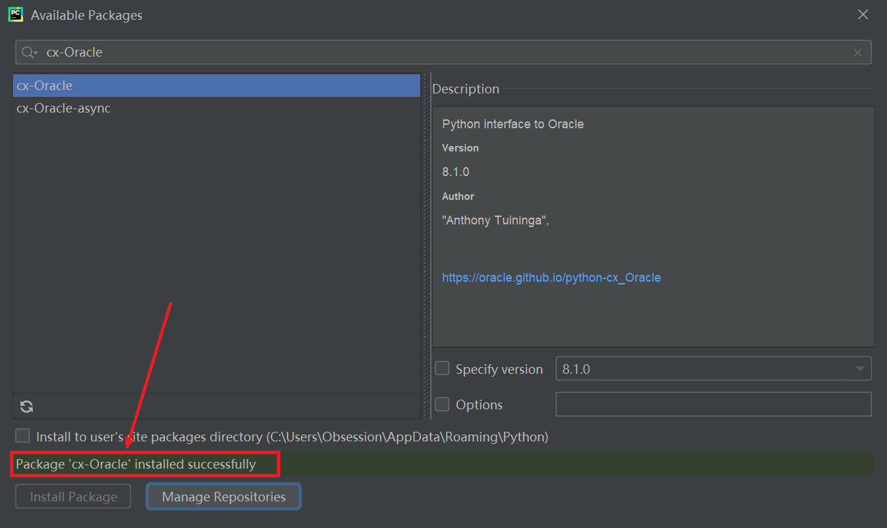

   关闭这个页面，在DCTools的解释器中，也可以找到刚才下载下来的cx-Oracle包：

   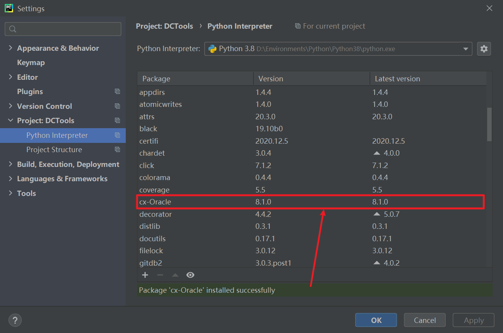

   安装上面的步骤，将需要的Python依赖依次下载下来。

### 3.4.3 下载超时问题

正常情况下，这些需要的Python依赖都挺好下载的，但是对于一些比较大的包，比如pyQt5这个包，在现在的时候容易出现下载超时失败，解决办法就是切换下载源。PyCharm使用的是我本地安装的Python，我本地安装的Python中的pip，使用的是官方下载源，该源是部署在国外的，所以下载起来很慢，容易连接超时。最好的办法就是切换下载源！

1. 添加下载源

   同样是打开Python解释器页面，点击Python依赖包的小加号：

   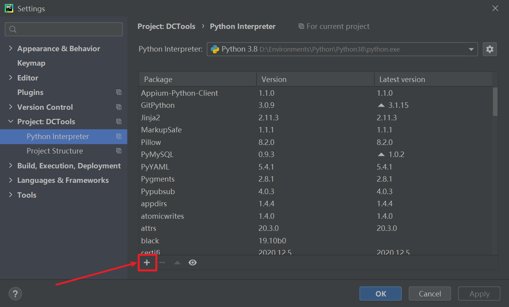

2. 点击Manage Respositories按钮：

   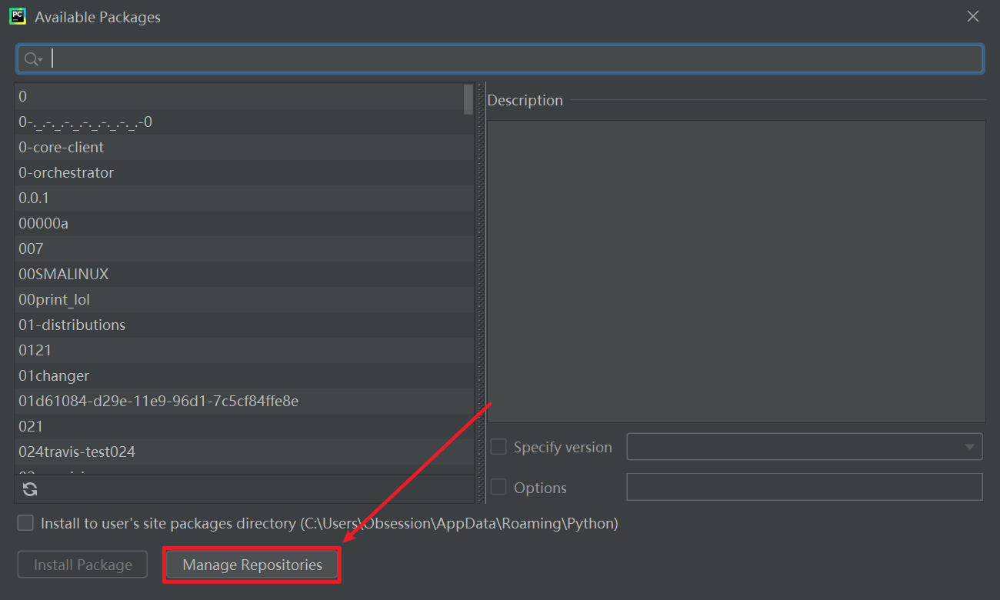

   在官方下载源的下面，再添加一个国内下载源，我这里提供一个清华大学的pip源：

   ```txt
   https://pypi.tuna.tsinghua.edu.cn/simple
   ```

   添加完成后是这样的：

   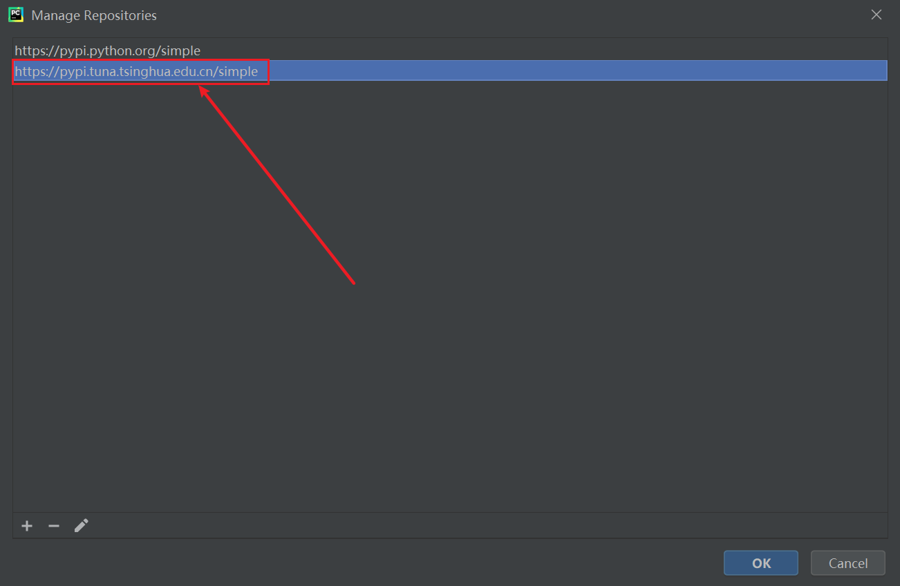

3. 搜索并下载Python包

   然后跟之前一样，搜索想要下载的Python依赖包，比如pyQt5：
   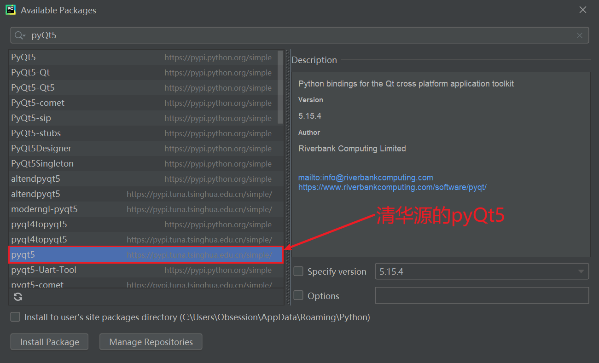

   然后下载清华源的pyQt5即可。

## 3.5 具体的打包操作

> 经过以上的准备，下面就可以通过运行DCTools项目中的Python文件，来生成可用的DCTools.exe文件了；
>
> 运行Python文件，既可以使用PyCharm，也可以使用Windows命令行，我这里演示的是使用Windows命令行；

### 3.5.1 修改工具版本信息

DCTools运行时，主界面会显示版本信息，它的值在配置文件中写定，每次打包的时候，都要重新设置为当前最新时间。

打开下载DCTools根目录下的`\src\file_version_info.txt`文件，修改4个地方的值：

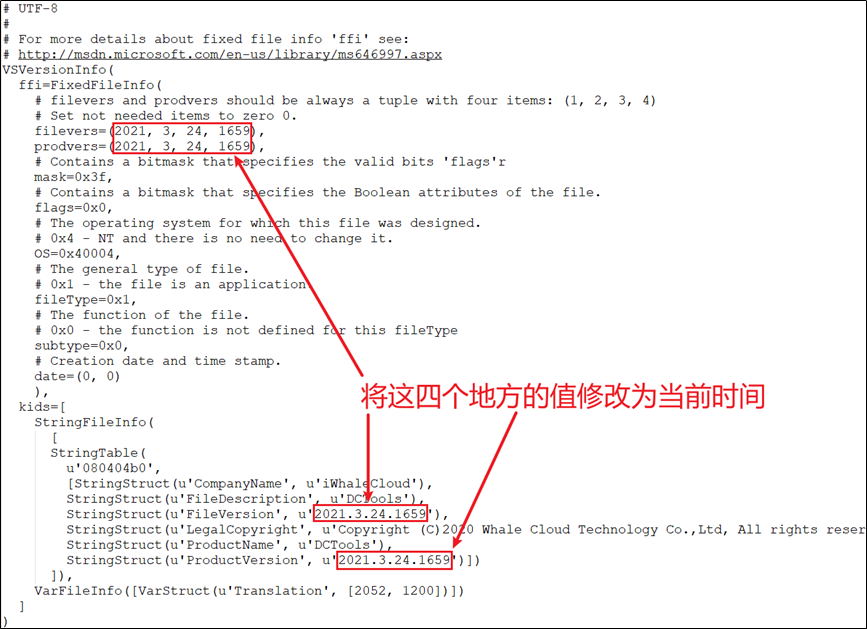

<font color=red>**注意**</font>：

1. **千万要注意格式！千万要注意格式！千万要注意格式！**
2. **年月日时分秒这四个位置的值，都不能以数字“0”开头！**

### 3.5.2 运行RunMainGUI

打开Windows命令行窗口，切换到下载DCTools目录下的src目录下，执行命令：

```bash
pyinstaller -F RunMainGUI.spec
```

当出现“Building EXE from EXE-00.toc completed successfully.”时，表示执行成功。然后到“F:\DCTools\src\dist”路径下，看到名为“DCTools.exe”的文件，这就是制作出来的可执行程序。

### 3.5.3 复制DCTools.exe

将上一步生成的`DCTools.exe`剪切(复制也可以)到DCTools的根目录下，比如我的情况是这样：

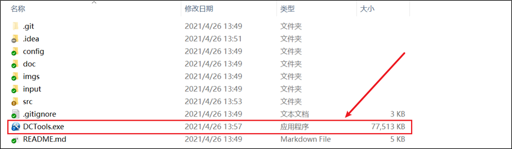

### 3.5.4 修改数据发布模式

修改DCTools根目录下的`\config\comm\comm.cfg`文件，将`toolModel`的值，由2改为1：


<font color=red>**注意**</font>：修改后一定要记得保存！

### 3.5.5 添加instantclient

将名为`instantclient`的文件夹复制到DCTools跟目录下：

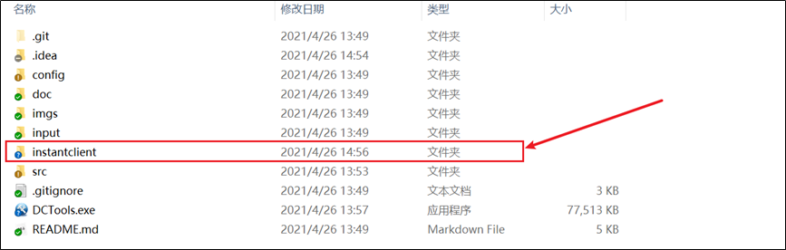

注意点：

1. 该文件夹是为了支持DCTools与Oracle数据库的交互；
2. 该文件夹从之前的版本中获取，由于该文件夹比较大，所以没有直接放在Gitlab上；

至此，我们就制作出可运行的DCTools应用程序了，也就是上图中的`DCTools.exe`。

### 3.6.6 选择文件并打包

> 经过以上步骤，此时DCTools可以在本地进行正确的使用了，那么下一步就是将其打成压缩包去发布，供别人下载使用

1. 明确哪些文件是要被打进压缩包的

   对于这些文件，我是不需要全部放进最后的压缩包的，最后的压缩包仅仅只需要这几个：

   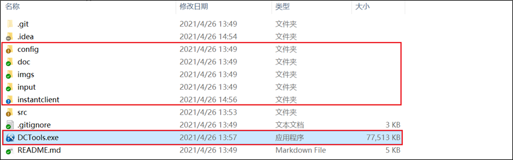

2. 将以上文件选中，右击选择发送到压缩包，然后这些文件就会被压缩到当前文件夹下的一个`zip`格式的压缩包中；

3. 将打出来的压缩包重命名，名称类似于如下格式（除了“win64”以外的数字，均是前面设置的版本信息）：

   ```bash
   DCTools20210322_win64_1636.zip
   ```

4. 最后，将制作完成的DCTools压缩包，上传到DCTools工具bug讨论群中名为“配置工具发布版本”的文件夹中即可。


# 第四章：出现错误

作为DCTools的维护者，假如在使用DCTools的过程中，出现了自己无法解决的问题，我们应该怎么做呢？

## 4.1 发送日志

当出现错误时需要给工具维护者发送此次错误操作相关的日志，发送错误日志有两种方式：

+ FindSupport

  使用DCTools的FindSupport功能，可以实现自动发送日志。如在数据导出页面操作时出现了错误，那么就点击该页面的FindSupport按钮，然后指定日志接收人，点击发送，这样被选的接收人就会在企业微信中收到日志

  

+ 手动发送

  日志就在DCTools根目录下的output目录下，找到后通过钉钉等发送给工具维护者：

  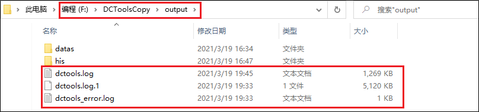

## 4.2 问题截图

比如我在验证导出数据的时候，应该是不需要密码的，但是验证结果却是需要密码的，所以将这个问题截图：

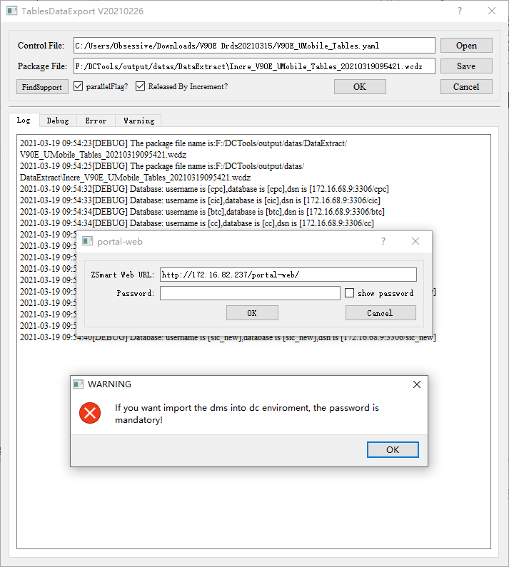

## 4.3 Gitlab提单

到Gitlab上(<http://gitlab.iwhalecloud.com/DC/DCTools>)，鼠标悬浮侧边栏的Issues后，在展开项中点击Boaeds：


因为这属于DCTools的bug问题，所以点击tools bug一栏后面的+号，来添加一条Issues：

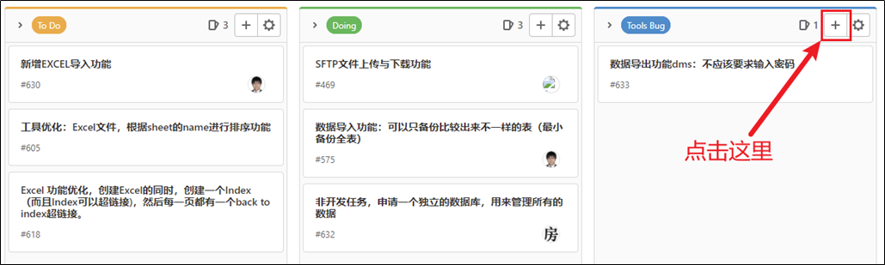

接着输入标题(问题描述)、点击submit issues，然后双击创建的issues的标题，进入详情页面，然后填写信息后提交

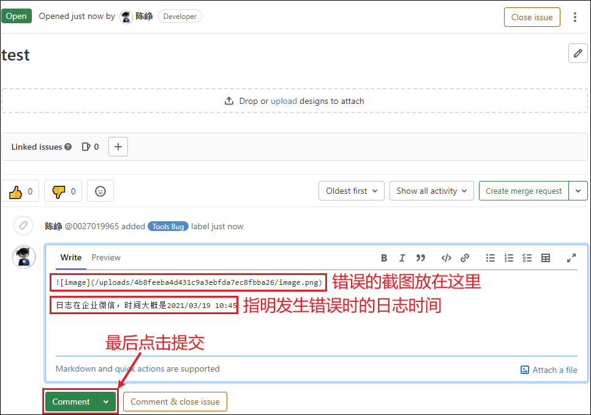然后在钉钉群里提示一下，你提交了一个问题在Gitlab上。

## 4.4 等待解决

在Gitlab上提单以后，就等待DCTools维护人员解决bug，等bug解决以后，再进行下面的操作。

## 4.5 重新打包

等待问题解决以后，首先更新DCTools源码(删除后再重新取也是一样的)，然后重新打包；

打包后，首先针对前面产生的bug验证一下，还没解决的话就继续提单；解决的话，打包完成；

