# 写在前面

在进行数据导入导出之前，首先你需要下载DCTools，并将其解压到本地的某个目录下，比如我的情况是：

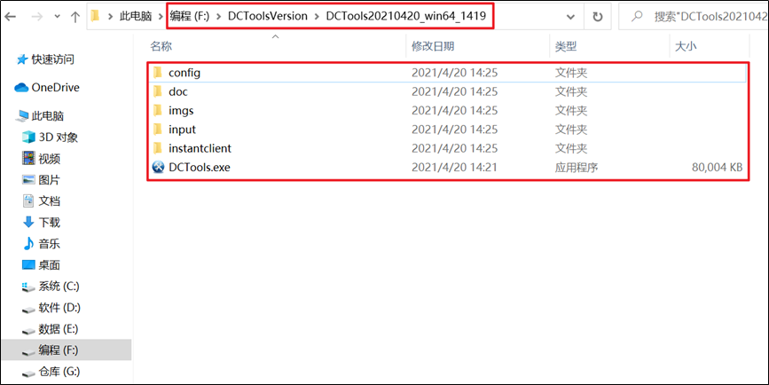

这里要注意两点：

1. DCTools的解压路径下，不能包含中文字符；
2. 解压后的文件如上图所示，包括`DCTools.exe`在内，共计是6个文件；


# 第一章：数据导出

> 这里以具体的例子来演示如何导出数据（以从马来UM项目的DC环境导出数据为例）；
>
> 演示是从Drds数据库（MySQL的分库分表）中导出数据，从Oracle导出数据的话会有一点小的区别，在本章最后一小节中会有讲解；

## 1.1 初始化项目

> <span style="color:red;">**为了表明我们下面要操作的环境是什么环境，所以在使用DCTools进行环境数据操作时，必须要先进行项目初始化！**</span>

1. 双击解压出来的DCTools.exe来运行它，假如是你本机第一次打开DCTools，那么你需要先初始化项目：

   

   然后就可以进入DCTools的主页面了：

   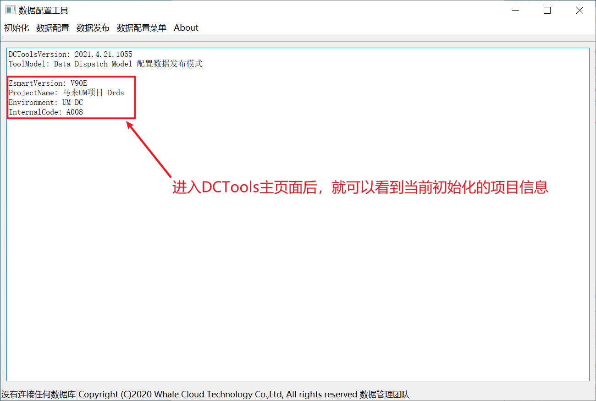

2. 假如你不是第一次使用该DCTools，那么进去以后，默认初始化的是上一次关闭前的项目。

   此时你需要在左上角依次选择`初始化`>`Project`来打开初始化项目页面，进行同样的初始化操作，不再赘述：

   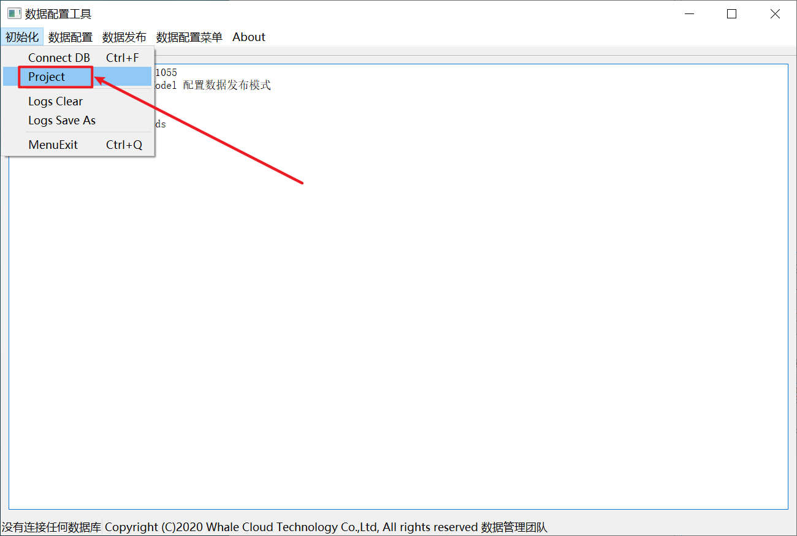

## 1.2 Export Date

> Export Date是数据导出功能的入口

1. 点击菜单栏的`数据发布`，选择`Export Date`，这是数据导出功能的入口：

   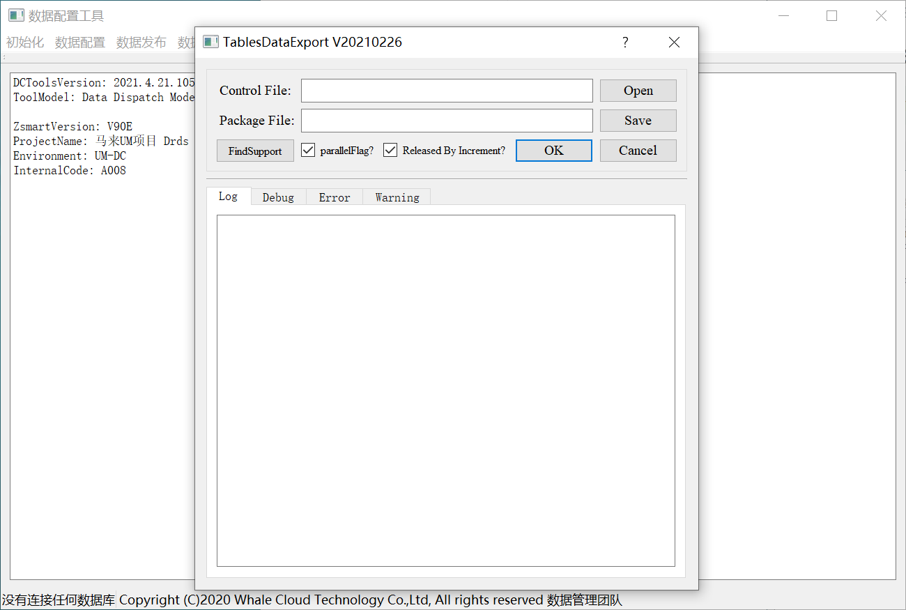

   这里先简单解释一下页面上的一些元素：

   | 元素                  | 名称     | 作用                                                         |
   | --------------------- | -------- | ------------------------------------------------------------ |
   | Control File          | 配置文件 | 用来规定同步范围的文件；<br />通过这个文件，可以确定接下来导出哪些库的哪些表的数据 |
   | Package File          | 数据包   | 数据导出以后生成的数据包                                     |
   | FindSupport           | 发送日志 | 当使用DCTools出现问题时，可以通过该按钮向工具维护者发送日志  |
   | paralledFlag          | 并行按钮 | 勾选的话，可以实现从多个数据库同时向外导出数据；<br />不勾选的话，就会按照配置文件指定的顺序依次导出；<br />同时允许几个数据库向外导出，是在配置文件中进行配置的； |
   | Released By Increment | 增量导出 | 若希望导入时先进行数据的比对，只导入有差异的数据，则需要勾选此项。<br />若勾选，要求导出的表都有主键（若无，在控制文件中添加虚拟主键）；<br />**增量导出的数据和全量导出的数据是一样的（区别是带不带出主键）**<br /> |

2. 针对我这次的导出操作，我进行如下的设置：

   

3. 选择控制文件时的注意点

   首先，针对马来Drds环境，我获取的控制文件如下：

   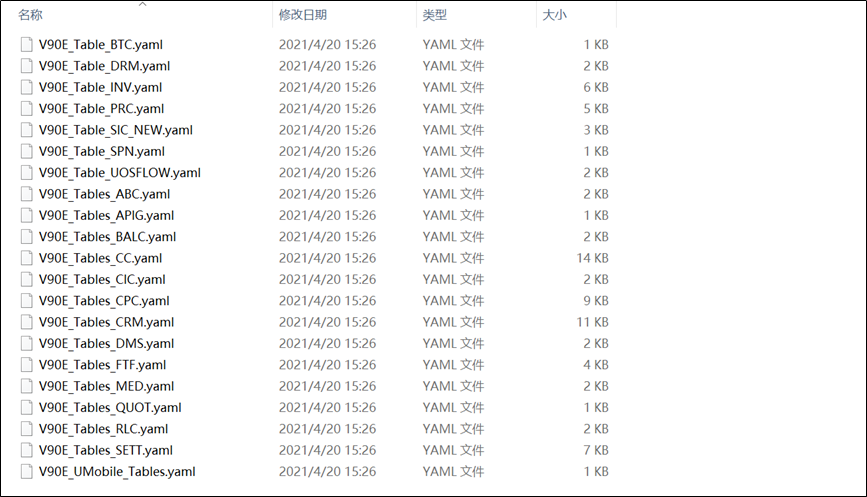

   其次，这么多控制文件，我该选择那个？当然是根据需求来选择：

   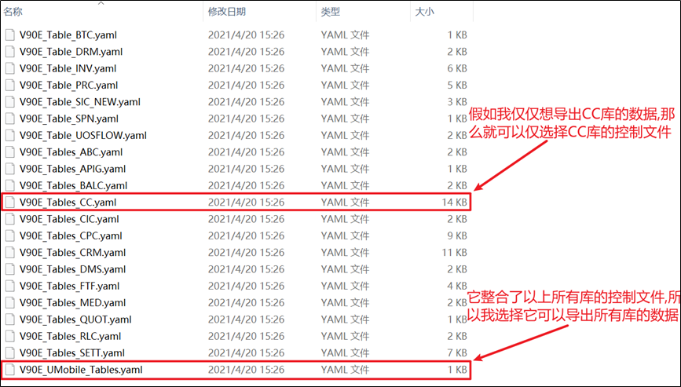

   <span style="color:red;">**注意点**</span>：关于配置文件的介绍，我会在第二章中进行详细的说明！

## 1.3 连接数据库

> 在进行数据导出的时候，肯定要连接数据库，才能对数据库中的数据进行导出

1. 说明

   上一步点击OK以后，此时会根据你选择的配置文件（Control File），依次弹出多个弹窗（假如你的控制文件选择的是单库的，那当然就只会弹出一个弹窗），每个弹窗对应着要求输入一个库的数据库信息。

2. 操作

   这里我以我配置文件指定的第一个库为例：

   

   <span style="color:red;">**在这里，要注意以下几点：**</span>

   - 假如Control File处选择的是单个数据库的配置文件，那么此处就只会弹出一个弹窗；

     假如Control File处选择的是整合多个数据库的配置文件，那么此处会依次弹出多个这样的弹窗；

   - 假如像我一样，Control File处选择的是整合多个数据库的配置文件，那么：

     想导出哪个库的数据，就填写哪个库对应的弹窗并点击Connect；

     不想导出哪个库的数据，就直接关掉那个库对应的弹窗即可，视为不连接该库、不导出该库的数据；

## 1.4 连接Portal

> 在进行数据导出的时候，除了要连接需要的数据库以外，还需要连接相对应的前台Portal

1. 上一步连接完需要连接的数据库以后，此时自动弹出连接前台portal的弹窗；

2. 输入对应的前台portal的URL后，直接点OK按钮即可：

   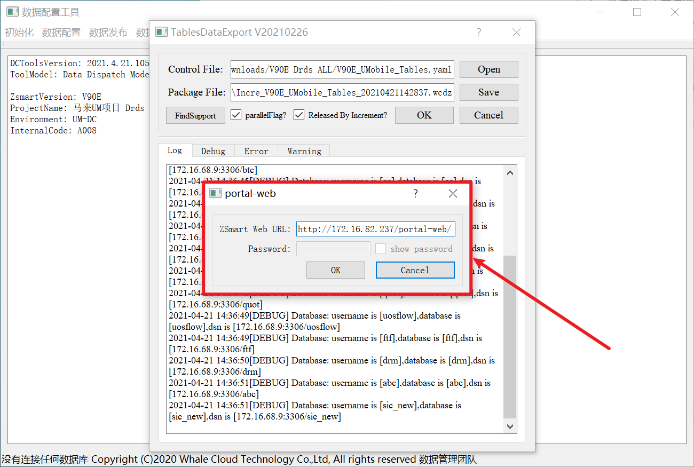

## 1.5 后续的操作

> 剩下的一些操作就是傻瓜式的点点点了

1. 前面填写前台Portal并点击OK以后，会跳出如下弹窗，点击OK：

   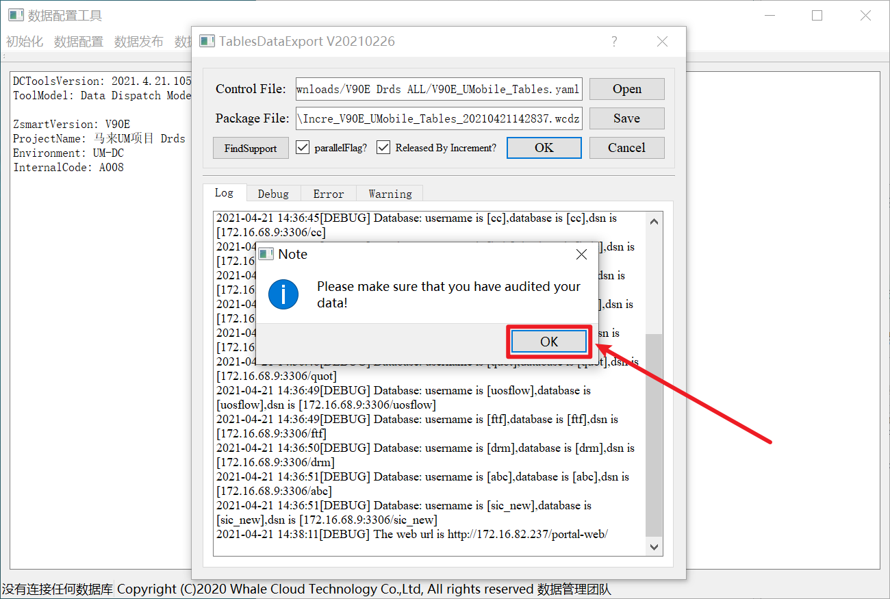

2. 接着弹出你之前配置的信息（导出哪些库的数据），确认无误后，点击Yes：

   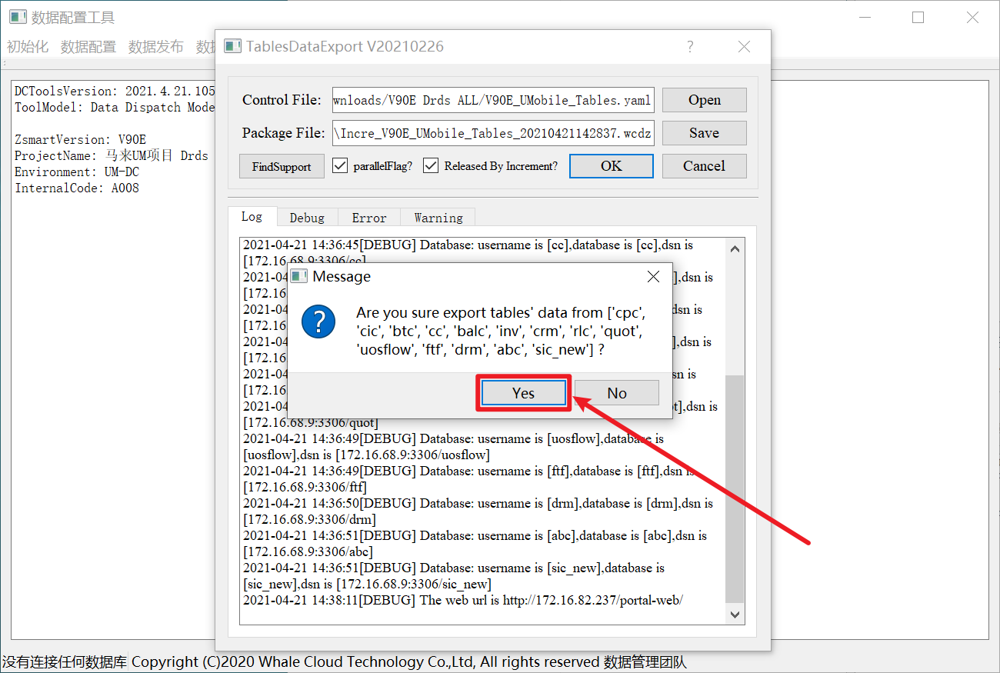

3. 然后，DCTools就开始导出数据了：

   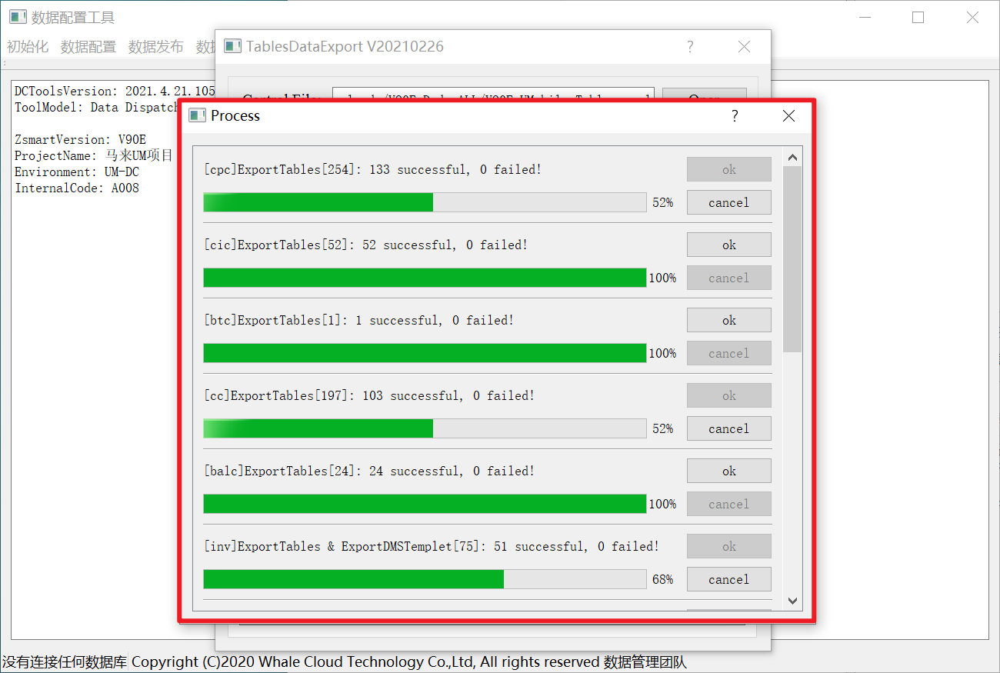

   因为是并行导出，所以所有库都是一起导出的，只是启动时间和速度快慢有所差异而已！

4. 待所有数据导出完成，DCTools会给出成功提示，点击OK即可：

   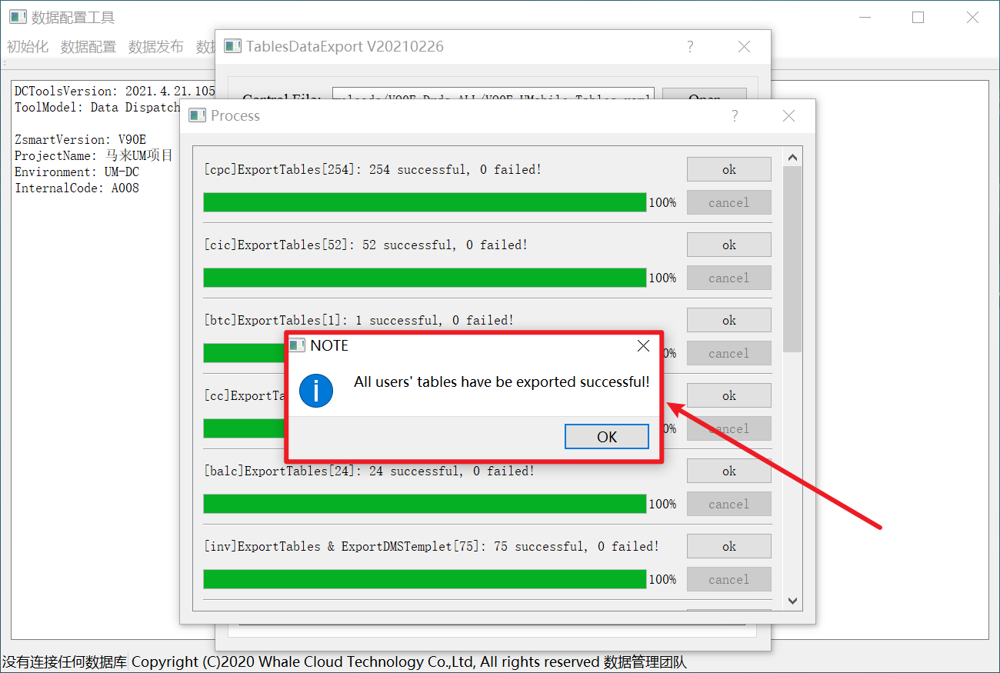

5. 点击上图中的OK以后，Process进度页面可以直接关掉：

   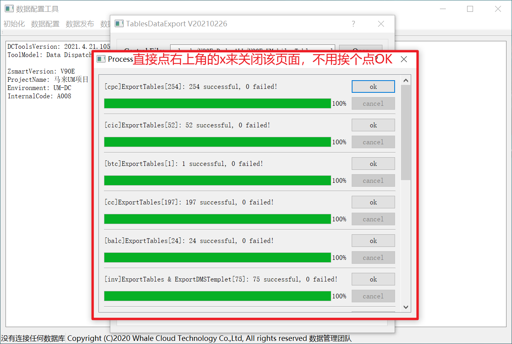

6. 经过以上的操作以后，数据就成功导出了。

   在DCTools的`\output\datas\DataExtract`目录下，生成的以`.wcdz`为扩展名的文件，就是导出的数据包：

   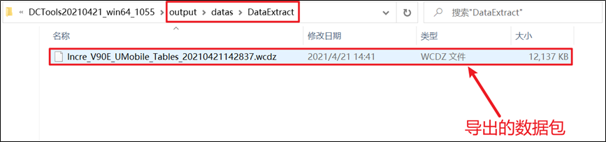

   `.wcdz`文件是不可查看的，将其后缀名改为`.zip`后再解压来查看其内容。

## 1.6 Oracle导出

> 从Oracle数据库导出数据，跟从Drds导出数据有所区别，这里以印度恒河水DC环境导出数据为例来讲解

1. 首先获取源数据库的信息；

2. 配置TNS

   打开DCTools下的`\config\comm\tnsnames.ora`文件，将源数据库的信息以如下格式追加在该文件的最后：

   ```ora
   XX_XXXX=
     (DESCRIPTION =
       (ADDRESS = (PROTOCOL = TCP)(HOST = xxx.xxx.xxx.xxx)(PORT = xxxxx))
       (CONNECT_DATA =
         (SERVER = DEDICATED)
         (SERVICE_NAME = xx)
       )
     )
   ```

   比如我配置的情况如下：

   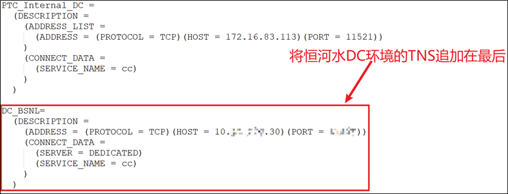

3. 导出数据

   从初始化项目开始进行数据导出操作，过程基本跟Drds是一样的，只是在连接数据库的时候有一些区别：

   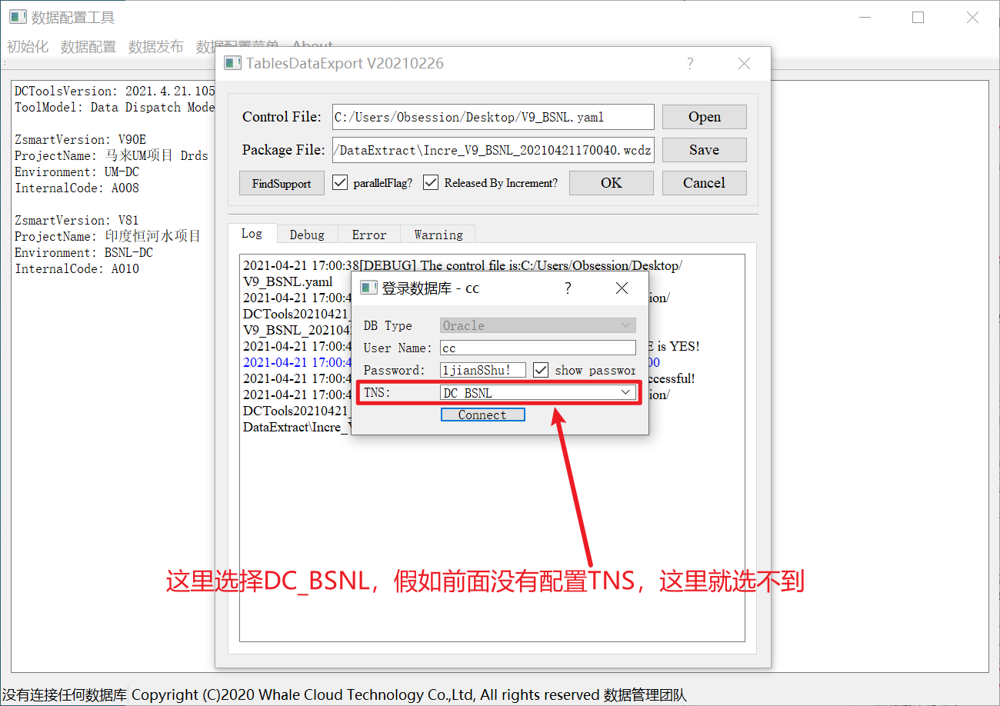

   最后导出成功：

   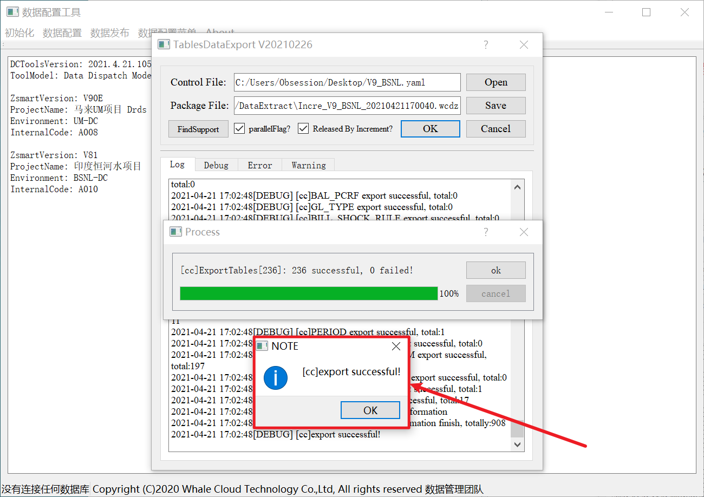

4. 导出的数据包

   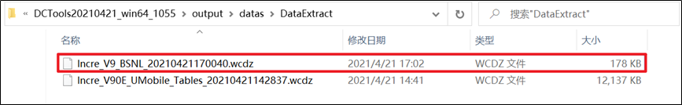


# 第二章：配置文件

所谓的配置文件，就是在数据导出的时候，在Control File处选择的文件，配置文件的扩展名必须是`.yaml`！

通过第一章的数据导出功能，我们已经知道，配置文件分为单个用户配置文件(导出某个库的数据)和多用户配置文件(导出多个库的数据)。

## 2.1 单个用户

> 在Control File处选择单个用户配置文件，可以仅仅针对这个库的数据进行导出。

单个用户的配置文件样例如下：

```yaml
TableList:
	- offer
	- product
TableSql:
	offer:
		SELECT * FROM offer a where a.offer_id between 1000000 and 4000000
	product:
		select * nfrom product a where prod_id between 5000 and 60000
DeleteSql:
	offer:
		- delete from offer where offer_id between 1000000 and 2000000
		- delete from offer where offer_id between 2000000 and 4000000
	product:
		- delete from product where prod_id between 50000 and 60000
BeforeImportSql:
	- update offer a set a.status_cd = 1000 where 1=1
	- update product a set a.status_cd = 1000 where 1=1
AfterImportSql:
	- update offer a set a.status_cd = 1000 where 1=1
	- update product a set a.status_cd = 1000 where 1=1
SequenceList:
	- SEQ_OFFER_ID
	- SEQ_PRODUCT
ThreadNumber: 8
TablePrimaryKey:
	offer: [offer_id,offer_type]
	product: [product_id]
PageLimit: 1000
```

- <span style="color:blue;">**TableList：指定需要导出数据的表的表名**</span>

  不区分大小写，如果表名拼写错误或配置的表名不存界面的debug日志会有提示。

- <span style="color:blue;">**TableSql：配置导出表数据时的查询语句**</span>

  如果是导出全部表的全部数据，那么这里可以不用配置；

  如果某张表只需要导出部分数据，则需要在该标签下配置相应的查询语句；

  如果源库中表的字段数多于目标库中表的字段数时，也可以配置SQL语句来只导出表的部分字段；

- <span style="color:blue;">**DeleteSql：配置导入目标库时删除目标表数据的删除语句**</span>

  支持配置多条，如果配置了删除语句，则会使用配置的删除语句覆盖自动生成的删除目标表数据的语句。如果为UDAL数据库，则会先使用自动生成的带_rowid的删除语句，删除目标表的数据，如果该表不存在_rowid字段，则使用配置的删除语句，否则使用自动生成的不带_rowid的删除语句删除目标表的数据。即优先级为_rowid>DeleteSql>自动生成的删除语句。

- <span style="color:blue;">**BeforeImportSql：配置数据导入前需要执行的sql语句**</span>

  数据导出时不会做任何处理，当将导出的数据导入到目标库前会执行该标签下配置的sql。

- <span style="color:blue;">**AfterImportSql: 配置数据导入后需要执行的sql语句**</span>

  数据导出时不会做任何处理，当将导出的数据导入到目标库后会执行该标签下配置的sql。

- <span style="color:blue;">**ThreadNumber: 配置导出时并行数量**</span>

  最好不要超过8，在导入时也会用该数值控制并行导入的并行数，并且每个并行会再开多个线程。

- <span style="color:blue;">**TablePrimaryKey: 配置表的主键**</span>

  当界面勾选增量导出时，如果表不存在主键，则需要在该标签下配置表的主键；

  注意：此处配置的主键只是逻辑主键，只是在导入导出时将其作为主键来使用，它并不是该表的真正的主键；

- <span style="color:blue;">**PageLimit：翻页数**</span>

  如果udal数据库限制了每次查询返回的记录数，则需要配置这个参数，参数的值需要严格与udal库每次能查询的最大记录数一致，比如1000(e.g某张表在数据库的总记录数超过1000，如果参数设置值为10000，这个时候因为数据库限制一次只能查询1000条，然而翻页数是10000，导致不能翻页只能导出1000条)，如果数据库没有查询限制，则不需要配置，默认为100000000000。

## 2.2 多个用户

> 在Control File处选择多个用户配置文件，可以自由选择对哪些库的数据进行导出。

多个用户的配置文件样例如下：

```yaml
UserNameList:
	cpc: V90E_Tables_CPC.yaml
	cc: V90E_Tables_CC.yaml
	crm: V90E_Tables_CRM.yaml
	cic: V90E_Tables_CIC.yaml
	balc: V90E_Tables_BALC.yaml
	uosflow: V90E_Tables_UOSFLOW.yaml
	ftf: V90E_Tables_FTF.yaml
	apig: V90E_Tables_APIG.yaml
	abc: V90E_Tables_ABC.yaml
	sfa: V90E_Tables_SFA.yaml
	inv: V90E_Tables_INV.yaml
	quot: V90E_Tables_QT.yaml
SchemaMapping:
	cc:
		- cc_0002
		- cc_0003
		- cc_0004
	crm:
		- crm_0002
		- crm_0003
		- crm_0004
	cic:
		- cic_0002
		- cic_0003
		- cic_0004
ParalleFlag: N
```

- <font color="blue">**UserNameList：配置所有的单个用户配置文件**</font>

  该标签下配置每个用户对应的配置文件名，这些配置文件必需在相同的目录下。

- <font color="blue">**ScheMapping：主要用于存在分库的情况**</font>

  以卢旺达项目为例，其中CC库有四个分库，在这里配置一下对cc_0002、cc_0003、cc_0004的映射，那么：

  导出的时候只连接cc_0001库就可以了；

  导入的时候分别往cc_0001、cc_0002、cc_0003、cc_0004导入；

## 2.3 如何选择

> 一般情况下，单个用户的和多个用户的配置文件都可以获取到，甚至在有了数据库以后，我们自己就可以整理出来，那么都有的情况下，我们应该怎么选择使用呢？

1. 单个用户的配置文件，针对单用户的数据操作更简单；

2. 多个用户的配置文件，针对多用户的数据操作更灵活；

   因为当我们使用多用户配置文件来连接数据库时，对于那些不想导出数据的用户，我们可以选择不连接。


# 第三章：数据导入

前面第一章中，我分别从马来DC环境（Drds）和印度DC环境（Oracle）中导出了数据，获取了两个增量导出的数据包。在这一章中，我将演示如何往目标库中导入数据。

## 3.1 初始化项目

> <span style="color:red;">**为了表明我们下面要操作的环境是什么环境，所以在使用DCTools进行环境数据操作时，必须要先进行项目初始化！**</span>

再次打开DCTools，因为上一次使用它初始化的项目是印度恒河水的DC环境，此时默认初始化的是恒河水DC环境。而现在要往马来E2E环境导入数据，所以首先要初始化项目为马来E2E环境：

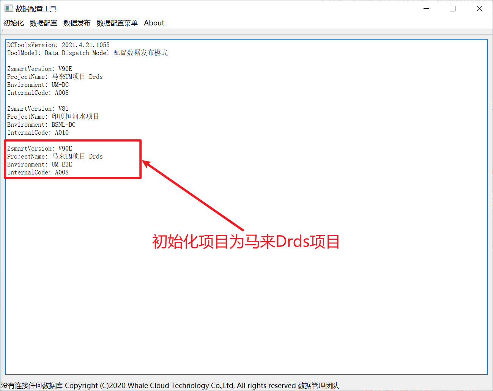

## 3.2 Import Data

> Import Data是数据导入功能的入口

1. 菜单栏中的`数据发布`，再选择`Import Data`，弹出数据导入页面：

   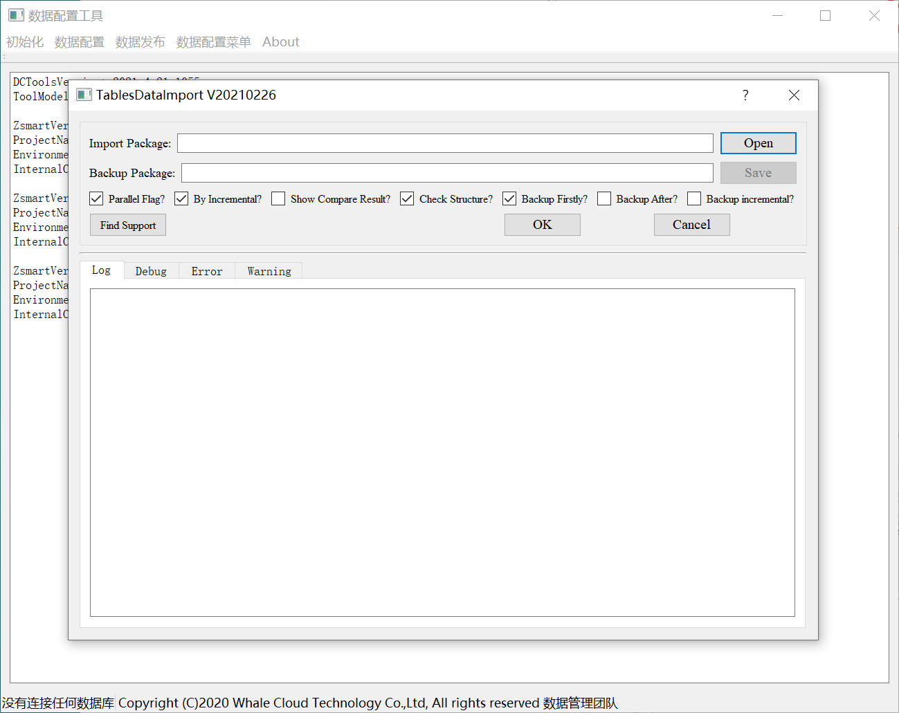

   这里先简单解释一下页面上的这些元素：
   
   | 元素               | 名称       | 作用                                                         |
   | ------------------ | ---------- | ------------------------------------------------------------ |
   | Import Package     | 数据包     | 这里选择的文件，是之前数据导出后生成的数据包                 |
   | Backup Package     | 备份包     | 在导入之前对目标库的数据进行备份所生成的备份数据包           |
   | Parallel Flag      | 并行导入   | 勾选的话，可以实现同时向多个用户库中导入数据；<br />不勾选的话，就会按照数据包指定的顺序依次导入； |
   | By Incremental     | 增量导入   | 假如数据包是增量导出的，那么这里就可以选择增量导入           |
   | Check Structure    | 检查表结构 | 勾选的话，会在导入时检查目标库跟源库的表结构                 |
   | Backup Firstly     | 导入前备份 | 勾选的话，会生成一个文件，在数据导入目标库前，对目标库的数据进行备份 |
   | Backup After       | 导入后备份 | 勾选的话，会生成一个文件，在数据导入目标库后，对目标库的数据进行备份 |
   | Backup incremental | 增量备份   | 勾选的话，会生成一个文件，用来记录此次导入数据所增加的数据   |

2. 针对这次数据导入，我做出如下操作：

   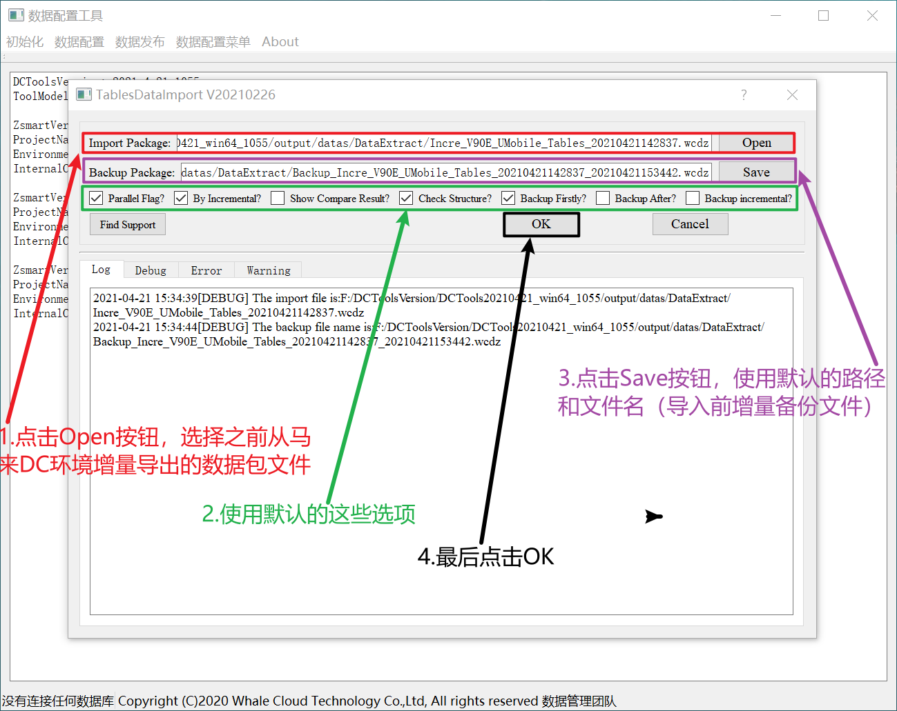

## 3.3 连接数据库

> 在进行数据导入的时候，肯定要连接数据库，才能像数据库中导入数据

上一步点击OK按钮以后，DCTools会根据选择的数据包文件，自动弹出连接数据库的弹窗。因为我这里选择的数据包之前导出的所有库的数据，DCTools会连续弹出多个弹窗，每个弹窗对应一个库。所以跟数据导入时一样，想连接哪个库并向其中导入数据，就填写哪个库对应的弹窗并点击Connect；不想连接哪个库就直接关掉对应的弹窗即可。

1. 比如我连接的abc库：

   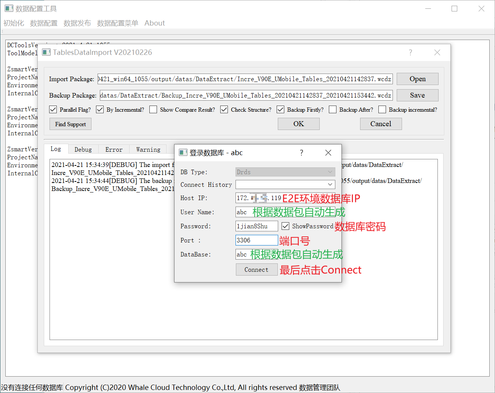

2. 比如我没连接的cpc分库（这里我也没有连接crm库）：

   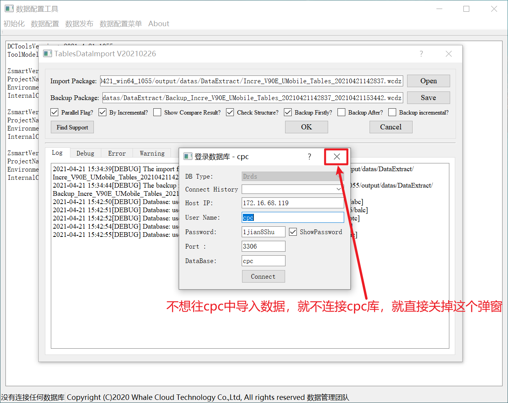

## 3.4 连接Portal

> 在进行数据导入的时候，除了要连接需要的数据库以外，还需要连接相对应的前台Portal

1. 上一步连接完需要连接的数据库以后，此时自动弹出连接前台portal的弹窗；

2. 输入对应的前台portal的URL后，直接点OK按钮即可：

   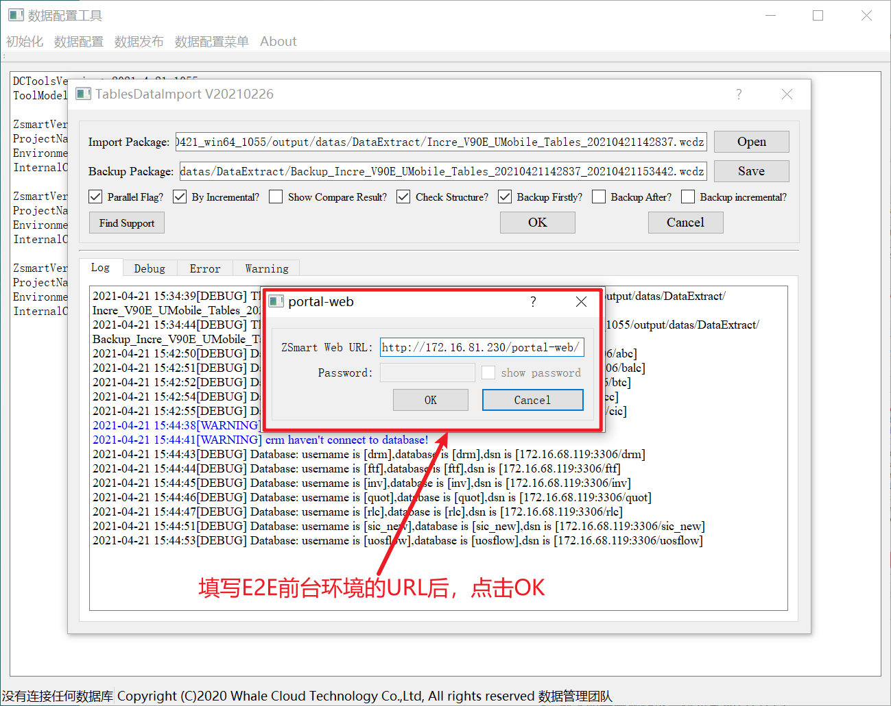

## 3.5 后续的操作

> 剩下的一些操作就是傻瓜式的点点点了

1. 前面填写前台Portal并点击OK以后，会跳出如下弹窗，点击Yes：

   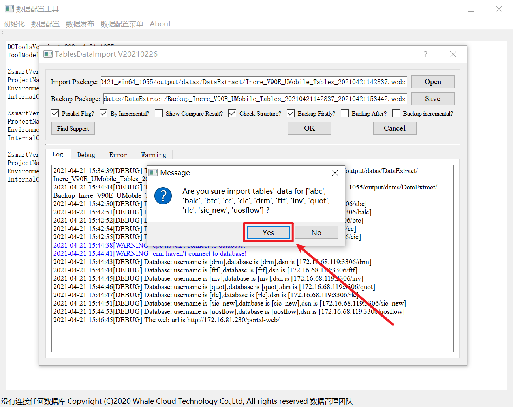

2. 然后DCTools就会往E2E环境导入数据了：

   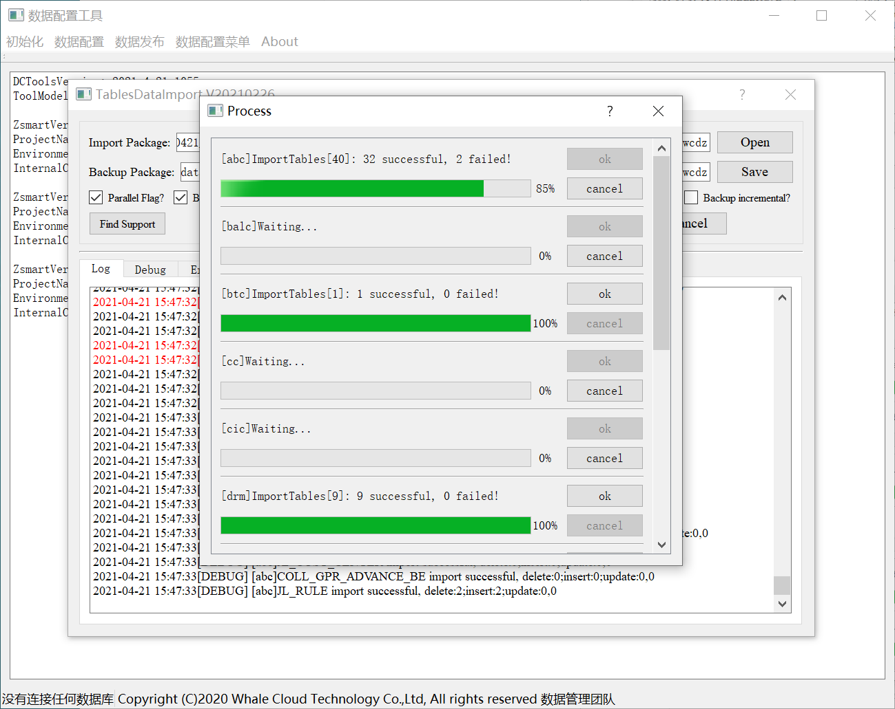

   此时可见导入失败了，这里是有问题的，解决问题以后，重新导入，导入成功后会有提示。

## 5.6 Oracle导入

> 往Oracle数据库导入数据，跟往Drds导入数据有所区别，这里以印度恒河水DC环境导出数据为例来讲解

1. 首先获取目标数据库的信息；

2. 配置TNS

   打开DCTools下的`\config\comm\tnsnames.ora`文件，将源数据库的信息以如下格式追加在该文件的最后：

   ```ora
   XX_XXXX=
     (DESCRIPTION =
       (ADDRESS = (PROTOCOL = TCP)(HOST = xxx.xxx.xxx.xxx)(PORT = xxxxx))
       (CONNECT_DATA =
         (SERVER = DEDICATED)
         (SERVICE_NAME = xx)
       )
     )
   ```

   比如我配置的情况如下：

   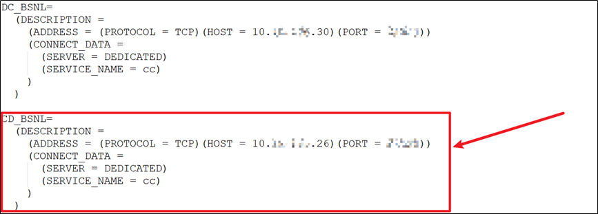

3. 导入数据

   从初始化项目开始进行数据导入操作，过程基本跟Drds是一样的，只是在连接数据库的时候有一些区别：

   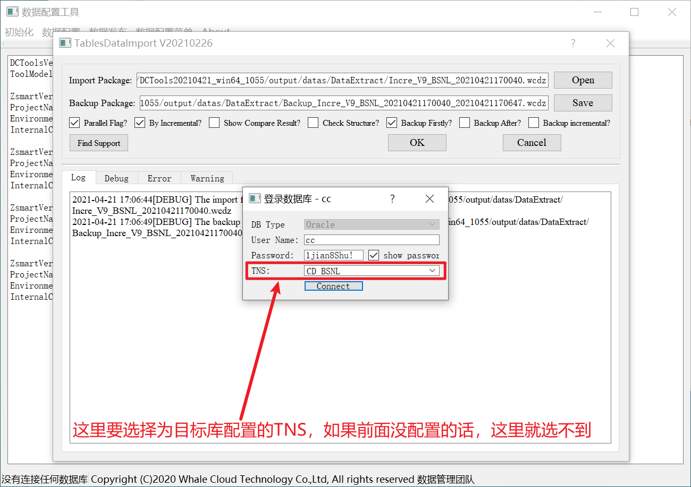

   导入成功后，会有成功提示。